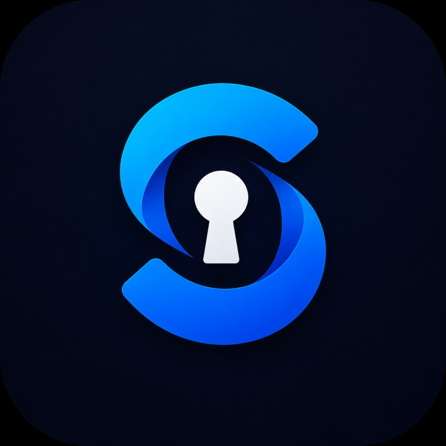
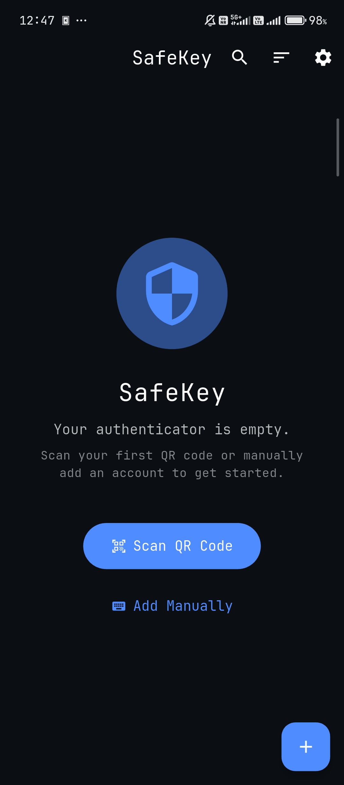
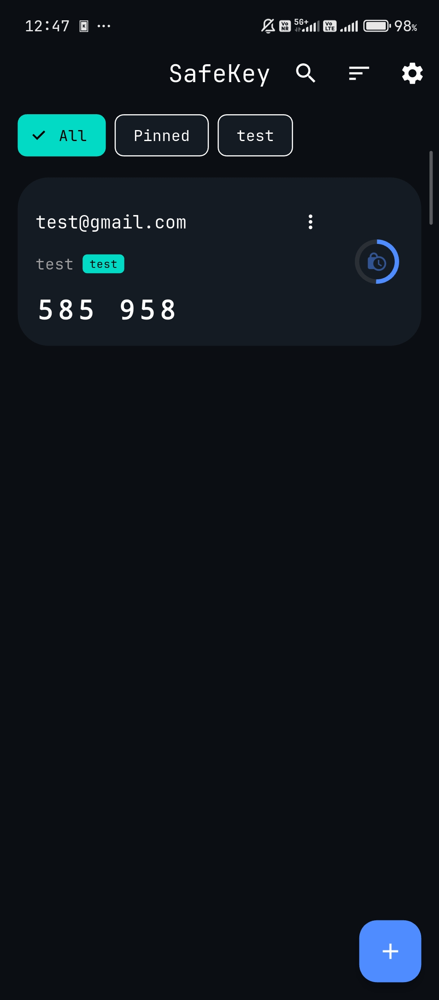
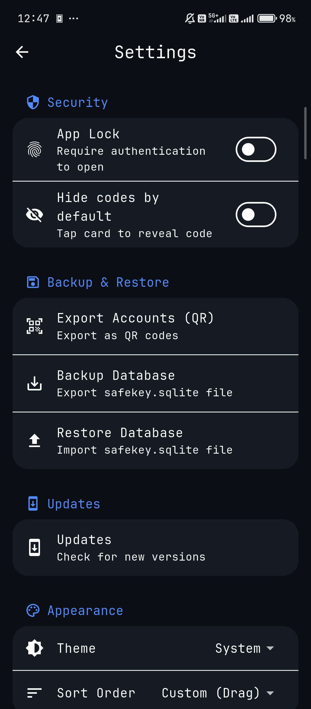

  
  <h1>SafeKey</h1>
  
<strong>A beautifully designed, secure, and offline-first Authenticator for Android.</strong>

  

    
    
    
    
    
  

  

    <a href="#features">Features</a> •
    <a href="#installation">Download</a> •
    <a href="#tech-stack">Tech Stack</a>
  

---

SafeKey is a local-first, privacy-respecting TOTP authenticator for Android. It stores all 2FA secrets securely on-device using an encrypted SQLite database and enforces access via native biometric authentication.

## Features

SafeKey was built from the ground up to guarantee that your most sensitive 2FA codes never leave your device. It doesn't even request Internet permissions in its Android Manifest—making data exfiltration physically impossible.

- **Standard TOTP Generation:** Fully compatible with Google Authenticator. Generates standard time-based one-time passwords using SHA1, SHA256, and SHA512 algorithms.
- **Encrypted Local Storage:** All account data is stored locally in an AES-256 encrypted SQLite database using SQLCipher. No data is sent to a central server.
- **Biometric App Lock:** Secures app access and sensitive operations (like database exports) using the device's native biometric APIs (fingerprint/face unlock).
- **Dynamic Tag Filtering:** Organizes accounts automatically via custom tags for quick retrieval and sorting.
- **Interactive UI:** A highly polished Material 3 design featuring 120Hz-friendly interactive animations, including cards that scale and elevate on touch.
- **Secure Backups:** Import or export accounts via standard `otpauth-migration` QR codes or raw encrypted database files.
- **In-App Updates:** Automatically fetches and installs updates directly from GitHub Releases via an elegant native updater, without requiring a central app store.

## Screenshots

  
  
  

## Tech Stack

- **Flutter & Dart:** Chosen to quickly build a highly responsive UI with 120Hz-friendly interactive animations. Currently compiled exclusively for Android.
- **Drift & SQLCipher:** Used for local persistence. Drift provides type-safe reactive SQL queries, while SQLCipher ensures the raw database file remains encrypted at rest.
- **Riverpod:** Handles state management for predictable data flow, which is necessary for reactive UI filtering and real-time TOTP progress updates.
- **Local Auth:** Integrates with Android's secure keystore to enforce biometric authentication.

## Installation

SafeKey is distributed as a pre-compiled Android APK.

1. Download the latest release APK from the [Releases](https://github.com/ARCns09/safekey/releases/latest) page.
2. Transfer the file to your Android device.
3. Open the file to install (you may need to enable "Install from unknown sources" in your Android settings).

## Project Structure

- `lib/core/` - Application-wide providers, security state, and routing configuration.
- `lib/database/` - Drift database schema, table definitions, and data access objects.
- `lib/features/` - Core UI screens divided by feature (e.g., home, scanner, settings, updater).
- `lib/widgets/` - Reusable UI components like animated TOTP account cards and filter chips.
- `Images/` - Screenshots used in the README documentation.

## Roadmap

- Native iOS support (pending Apple Developer provisioning).
- Support for HOTP (counter-based) tokens.
- Automated local encrypted backups to user-defined directories.

## Contributing

Contributions are welcome. For major changes, please open an issue first to discuss what you would like to change.

1. Fork the project.
2. Create your feature branch (`git checkout -b feature/NewFeature`).
3. Ensure the code passes formatting and linting (`flutter analyze`).
4. Commit your changes (`git commit -m 'Add NewFeature'`).
5. Push to the branch (`git push origin feature/NewFeature`).
6. Open a Pull Request.

## License

SafeKey source code is publicly available for transparency and personal use, but custom licensing applies to protect the project's branding, distribution, and commercial rights. See the [LICENSE](LICENSE) file for specific terms of use. Additional information can be found in the `docs/legal/` directory.
